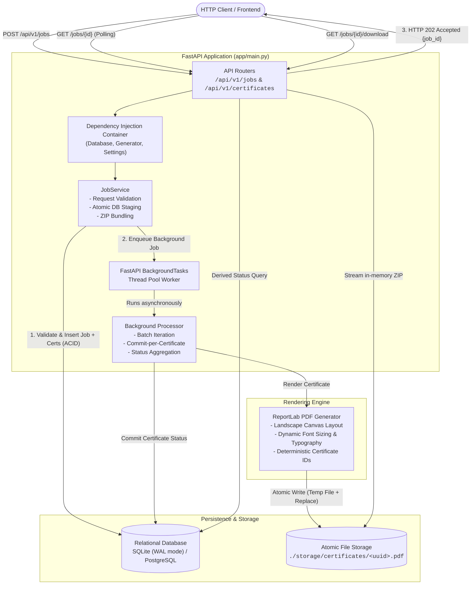
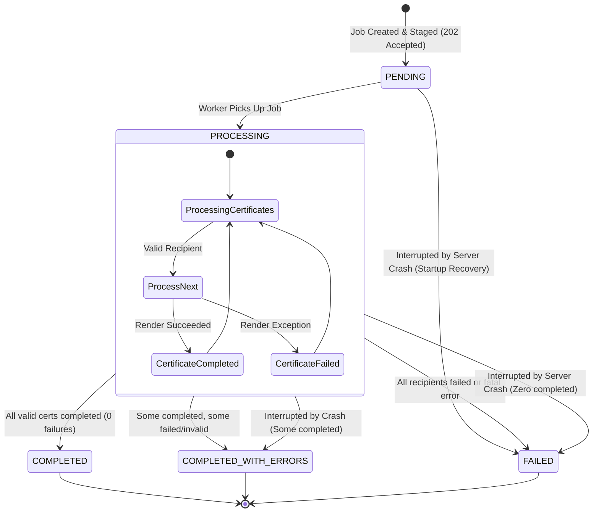
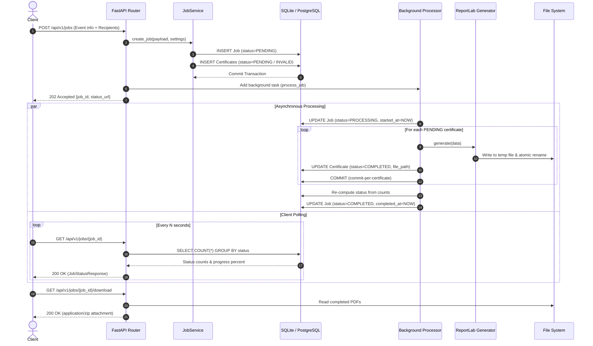
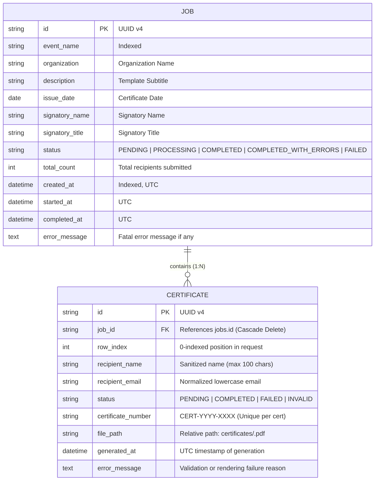

<div align="center">

# Bulk Certificate Generator API

**High-Throughput, Fault-Tolerant Asynchronous Batch PDF Generation Engine**

[](https://www.python.org/)
[](https://fastapi.tiangolo.com)
[](https://www.sqlalchemy.org/)
[](https://docs.pydantic.dev/)
[](https://www.reportlab.com/)
[](https://pytest.org)
[](https://opensource.org/licenses/MIT)

<p align="center">
  A production-grade RESTful API built for high-scale certificate issuance following conferences, hackathons, and courses. 
  Engineered with strict failure isolation (bulkhead pattern), atomic persistence, zero-counter-drift state modeling, and crash recovery.
</p>

</div>

---

## Table of Contents

- [Overview](#overview)
- [System Architecture](#system-architecture)
  - [High-Level Architecture](#high-level-architecture)
  - [Job State Machine & Resilience](#job-state-machine--resilience)
  - [Execution Sequence](#execution-sequence)
  - [Data Model (ER Diagram)](#data-model-er-diagram)
- [Engineering Highlights & Design Patterns](#engineering-highlights--design-patterns)
- [API Reference](#api-reference)
- [Quick Start](#quick-start)
  - [Local Setup](#local-setup)
  - [Docker & Docker Compose](#docker--docker-compose)
- [Testing & Quality Assurance](#testing--quality-assurance)
- [Performance & Benchmarks](#performance--benchmarks)
- [Configuration Reference](#configuration-reference)
- [Production Roadmap](#production-roadmap)
- [License](#license)

---

## Overview

Generating thousands of PDFs synchronously over HTTP causes socket timeouts, thread starvation, and brittle user experiences. Furthermore, if a single recipient possesses an invalid name or malformed email address, traditional pipelines reject the entire batch or fail silently.

The **Bulk Certificate Generator API** solves these challenges through:
1. **Immediate Asynchronous Hand-off (`202 Accepted`)**: Submissions are validated and persisted in a single ACID transaction within milliseconds, returning a unique `job_id` and tracking endpoint.
2. **Bulkhead Failure Isolation**: Individual recipient validation failures or PDF rendering errors are captured and isolated. A corrupt recipient never halts processing for valid participants.
3. **Derived Real-Time Consistency**: Job progress and terminal states are calculated dynamically from underlying row states (`GROUP BY status`), completely eliminating counter desynchronization or race conditions.
4. **Crash Resiliency**: An automated lifespan startup recovery hook identifies interrupted jobs following server crashes or ungraceful reboots, safely transitioning them to terminal states.
5. **Atomic File I/O**: Certificates are rendered to temporary staging buffers before atomic renaming (`os.replace`), preventing corrupted or partially written PDFs from ever reaching clients.

---

## System Architecture

### High-Level Architecture



---

### Job State Machine & Resilience



---

### Execution Sequence



---

### Data Model (ER Diagram)



---

## Engineering Highlights & Design Patterns

### 1. Bulkhead Failure Isolation
A single invalid recipient (e.g. empty name, invalid email format, duplicate email) or an unexpected error during PDF rendering will **never abort the entire batch**. The offending record is marked as `INVALID` or `FAILED` with an explicit reason, while all remaining valid recipients proceed smoothly to completion.

### 2. Derived State Machine (No Counter Drift)
Many systems maintain integer counters (`completed_count`, `failed_count`) on the parent job record. If an unhandled exception or process termination occurs midway, counters drift out of sync with actual rows. In this architecture, status counts and overall job progress are derived directly at query time via a high-performance indexed `GROUP BY status` aggregation.

### 3. Commit-Per-Certificate Pipeline
Rather than holding a single database transaction open across thousands of PDF rendering iterations, the background worker commits each completed certificate independently. This yields two major advantages:
- Clients polling the status endpoint observe genuine real-time progress updates.
- If the server experiences a power failure or crash, already-rendered certificates remain safely committed on disk and in the database.

### 4. Zero-Downtime Startup Crash Recovery
If the server abruptly halts while jobs are in `PENDING` or `PROCESSING` state, an automated lifespan recovery routine executes upon restart:
- Identifies any orphaned jobs lacking active worker threads.
- Inspects their completed certificates to assign accurate terminal states (`COMPLETED_WITH_ERRORS` or `FAILED`).
- Prevents jobs from lingering indefinitely in an unresolved state.

### 5. Atomic File Operations & Directory Traversal Protection
- **No Half-Written Files**: PDFs are streamed into temporary files (`.tmp`) and then atomically renamed via POSIX/Windows `os.replace`.
- **Path Sanitization**: Certificate files are strictly named using server-generated UUIDs (`<uuid>.pdf`). Client-provided input is never incorporated into storage paths, eliminating path traversal risks.

---

## API Reference

Interactive OpenAPI documentation is automatically available at:
- **Swagger UI**: `http://localhost:8000/docs`
- **ReDoc**: `http://localhost:8000/redoc`

### Endpoints Overview

| Method | Endpoint | Status | Description |
|---|---|---|---|
| `POST` | `/api/v1/jobs` | `202 Accepted` | Submit a batch certificate generation job |
| `GET` | `/api/v1/jobs/{job_id}` | `200 OK` | Fetch real-time job status and progress counts |
| `GET` | `/api/v1/jobs/{job_id}/certificates` | `200 OK` | Paginated listing of certificates with optional status filtering |
| `GET` | `/api/v1/jobs/{job_id}/download` | `200 OK` | Download ZIP archive of all completed certificates |
| `GET` | `/api/v1/certificates/{id}/download` | `200 OK` | Download a single certificate PDF |
| `GET` | `/health` | `200 OK` | Healthcheck and readiness probe |

---

### Request & Response Examples

#### 1. Submit Batch Job
`POST /api/v1/jobs`

```json
{
  "event_name": "Cloud Native Summit 2026",
  "organization": "Open Source Community",
  "description": "for successfully completing the Distributed Systems Workshop",
  "issue_date": "2026-10-08",
  "signatory_name": "Dr. Elena Rostova",
  "signatory_title": "Director of Engineering",
  "recipients": [
    { "name": "Alice Johnson", "email": "alice@example.com" },
    { "name": "Bob Smith", "email": "bob@example.com" },
    { "name": "", "email": "invalid@example.com" }
  ]
}
```

**Response (`202 Accepted`):**
```json
{
  "job_id": "97e682d3-138d-4f24-9b5f-eaec3b856711",
  "status": "PENDING",
  "total": 3,
  "accepted": 2,
  "rejected": 1,
  "status_url": "/api/v1/jobs/97e682d3-138d-4f24-9b5f-eaec3b856711"
}
```

---

#### 2. Poll Job Status
`GET /api/v1/jobs/97e682d3-138d-4f24-9b5f-eaec3b856711`

**Response (`200 OK`):**
```json
{
  "job_id": "97e682d3-138d-4f24-9b5f-eaec3b856711",
  "status": "COMPLETED_WITH_ERRORS",
  "event_name": "Cloud Native Summit 2026",
  "organization": "Open Source Community",
  "total": 3,
  "counts": {
    "pending": 0,
    "completed": 2,
    "failed": 0,
    "invalid": 1
  },
  "processed": 3,
  "progress_percent": 100.0,
  "created_at": "2026-10-08T11:00:00Z",
  "started_at": "2026-10-08T11:00:00.120000Z",
  "completed_at": "2026-10-08T11:00:01.350000Z",
  "error_message": null,
  "failures": [
    {
      "certificate_id": "a1b2c3d4-0000-0000-0000-000000000003",
      "row_index": 2,
      "recipient_name": "",
      "recipient_email": "invalid@example.com",
      "status": "INVALID",
      "error_message": "recipient name cannot be empty"
    }
  ],
  "download_url": "/api/v1/jobs/97e682d3-138d-4f24-9b5f-eaec3b856711/download"
}
```

---

## Quick Start

### Local Setup

#### Prerequisites
- Python 3.10, 3.11, 3.12, or 3.13
- Git

```bash
# 1. Clone repository
git clone https://github.com/Taarun8431/BULK_CERTIFICATE_GENERATOR_API.git
cd BULK_CERTIFICATE_GENERATOR_API

# 2. Create virtual environment
python -m venv .venv

# On Linux / macOS:
source .venv/bin/activate

# On Windows (PowerShell):
.venv\Scripts\Activate.ps1

# 3. Install dependencies
pip install -r requirements-dev.txt

# 4. Start the server
uvicorn app.main:app --host 0.0.0.0 --port 8000 --reload
```

---

### Docker & Docker Compose

Deploy the API with zero host Python dependencies:

```bash
# Build and run container
docker compose up -d --build

# Inspect logs
docker compose logs -f

# Verify health status
curl http://localhost:8000/health
```

---

## Testing & Quality Assurance

The codebase includes an exhaustive automated test suite with **87 tests** spanning 7 targeted test modules.

```bash
# Run complete test suite
pytest -v

# Run with quiet summary
pytest -q

# Run specific functional areas
pytest tests/test_certificate_generation.py -v   # Layout & ReportLab Canvas verification
pytest tests/test_failure_handling.py -v         # Bulkhead fault isolation
pytest tests/test_recovery_and_health.py -v      # Server crash recovery hooks
```

### Test Coverage Highlights

| Module | Tests | Focus Area |
|---|---|---|
| `test_certificate_generation.py` | 9 | ReportLab canvas rendering, PDF signature verification, coordinate layout |
| `test_failure_handling.py` | 9 | Generator failures, invalid recipients, non-blocking batch execution |
| `test_input_validation.py` | 19 | Boundary checks, control characters, max length, invalid emails, empty lists |
| `test_job_creation.py` | 10 | ACID staging, 202 status, transaction rollback on failure |
| `test_job_status_progress.py` | 11 | State machine transitions, derived counts, 100% progress assertion |
| `test_recovery_and_health.py` | 10 | Startup interrupted job detection, SQLite StaticPool, /health probe |
| `test_retrieval.py` | 19 | Single PDF streaming, ZIP archive generation, pagination, 404/409 scenarios |
| **Total** | **87** | **100% Passing in ~8.4 seconds** |

---

## Performance & Benchmarks

Generate synthetic load datasets using the included generator utility:

```bash
# Generate a test payload with 500 recipients
python sample_data/large_request_generator.py 500 > sample_data/large_500.json

# Submit batch to local instance
curl -X POST http://localhost:8000/api/v1/jobs \
  -H "Content-Type: application/json" \
  -d @sample_data/large_500.json
```

**Single-Process Benchmark Results (Intel i7 / Ryzen 7):**
- **HTTP Staging Latency**: ~35ms for 500 recipients (immediate 202 Accepted).
- **PDF Generation Speed**: ~40–50 certificates per second.
- **500 Certificates Total Processing Time**: ~11–13 seconds.
- **ZIP Bundling Speed**: <1.2 seconds for 500 in-memory compressed certificates.

---

## Configuration Reference

Configure settings via environment variables or a `.env` file:

| Variable | Type | Default | Description |
|---|---|---|---|
| `DATABASE_URL` | String | `sqlite:///./certificates.db` | SQLAlchemy connection string (SQLite WAL mode or PostgreSQL) |
| `STORAGE_DIR` | String | `./storage` | Filesystem path for generated PDF certificates |
| `MAX_RECIPIENTS_PER_REQUEST` | Integer | `1000` | Upper limit of recipients accepted per HTTP request |
| `MAX_NAME_LENGTH` | Integer | `100` | Maximum character length allowed for recipient names |
| `LOG_LEVEL` | String | `INFO` | Logging verbosity (`DEBUG`, `INFO`, `WARNING`, `ERROR`) |

---

## Production Roadmap

For enterprise-scale multi-region deployment, the codebase is modularly structured to enable seamless extensions:

- [ ] **Distributed Task Queue**: Drop-in swap from FastAPI `BackgroundTasks` to Celery + Redis or AWS SQS.
- [ ] **Object Storage**: Swap local filesystem storage for Amazon S3 / Google Cloud Storage.
- [ ] **Webhook Notifications**: Dispatch a signed HTTP callback (`HMAC-SHA256`) when a job transitions to a terminal state.
- [ ] **Internationalization (i18n)**: Embed Google Noto or DejaVu TTF fonts for multi-lingual and CJK script support.
- [ ] **Alembic Migrations**: Formal database schema versioning and zero-downtime migrations.

---

## License

Distributed under the MIT License. See [LICENSE](LICENSE) for details.

Developed with architectural rigor by **Taarun8431**.
